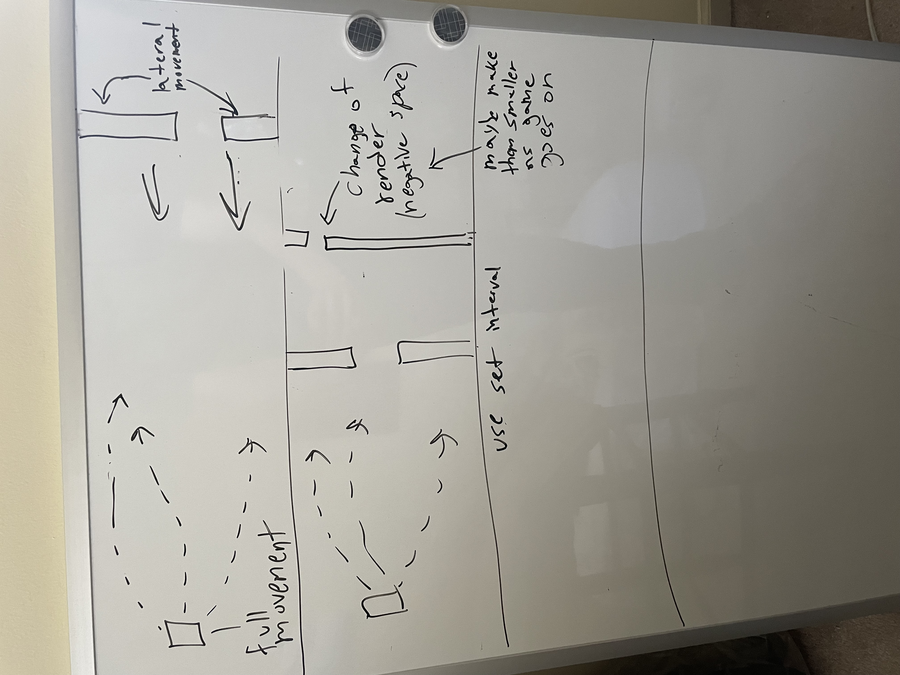

# Game-Project-1

## Mega-Man2-ish throwback - a canvas-based user game involving avoidance of obstructions

### Concept:

###### This game will be about a user free to move through an environment with a wall  rendering moving across the environment.
---
###### The wall's function:
- ###### The wall will be composed of two thin rectangular rendered spaces in line with each other along the y-axis
- ###### The wall will travel along the x-axis from right to left, at a set interval rate
- ###### It's speed will increase as the game difficulty increases, via a new stage annnouncement 
- ###### There will be a space in which the user can travel through to avoid collision
- ###### The space will change to a predetermined location
- ###### The space will decrease as the game difficulty increases
---
###### The user's function:

- ###### The user will be free to move throughout the environment as the wall moves from right to left. 
- ###### The user will have a set movement speed
---
###### Stretch goals: 
- ###### Incorporate several spaces per wall that the user can travel through
- ###### Incorporate an additional wall trailing behind so the user has to quickly navigate through the space of the first wall and around the other. 
- ###### Create diagonal walls
---
###### tools:

- ###### HTML
- ###### CSS
- ###### Javascript
- ###### Canvas

